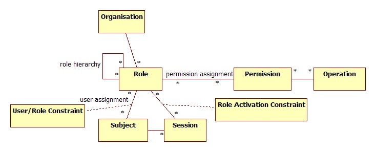

# Access Control (ACL)

## Access control lists (ACL) 

 An ACL is a means of defining access rights by a given user or user group, to a specific object, such as a document.  As a simple example, an ACL could be used to allow users from one department to make changes to a document, while only allowing users from other departments to read the document.

## Attribute-based access control (ABAC) 

 sometimes known as policy-based access control, can use a variety of attributes, including user department, time of day, location of access, type of access required, etc. to determine whether a user’s access request should be granted.
Both of these options provide additional granularity of controls beyond the basic concept of RBAC, but can also greatly expand the effort required to create and maintain the necessary permissions.  RBAC arguably offers a more simplified and manageable approach, given that the privileges of a user in a given position are granted with a simple effort, to all others in the same role.  These methods can, however, be used in tandem to increase control.

Access control lists (ACLs) are used in traditional discretionary access-control systems to affect low-level data-objects. RBAC differs from ACL in assigning permissions to operations which change the direct-relations between several entities (see: ACLg below). For example, an ACL could be used for granting or denying write access to a particular system file, but it wouldn't dictate how that file could be changed. In an RBAC-based system, an operation might be to 'create a credit account' transaction in a financial application or to 'populate a blood sugar level test' record in a medical application. A Role is thus a sequence of operations within a larger activity. 

RBAC has been shown to be particularly well suited to separation of duties (SoD) requirements, which ensure that two or more people must be involved in authorizing critical operations. Necessary and sufficient conditions for safety of SoD in RBAC have been analyzed. An underlying principle of SoD is that no individual should be able to effect a breach of security through dual privilege. By extension, no person may hold a role that exercises audit, control or review authority over another, concurrently held role. 

Then again, a "minimal RBAC Model", RBACm, can be compared with an ACL mechanism, ACLg, where only groups are permitted as entries in the ACL. Barkley (1997) showed that RBACm and ACLg are equivalent.

## Role-based access control (RBAC)

 or role-based security is an approach to restricting system access to authorized users. It is an approach to implement mandatory access control (MAC) or discretionary access control (DAC).

Role-based access control (RBAC) is a policy-neutral access-control mechanism defined around roles and privileges. The components of RBAC such as role-permissions, user-role and role-role relationships make it simple to perform user assignments. A study by NIST has demonstrated that RBAC addresses many needs of commercial and government organizations. RBAC can be used to facilitate administration of security in large organizations with hundreds of users and thousands of permissions. Although RBAC is different from MAC and DAC access control frameworks, it can enforce these policies without any complication.

### Three primary rules are defined for RBAC:

1.	Role assignment: A subject can exercise a permission only if the subject has selected or been assigned a role.

2.	Role authorization: A subject's active role must be authorized for the subject. With rule 1 above, this rule ensures that users can take on only roles for which they are authorized.

3.	Permission authorization: A subject can exercise a permission only if the permission is authorized for the subject's active role. With rules 1 and 2, this rule ensures that users can exercise only permissions for which they are authorized.

### Use and availability

The use of RBAC to manage user privileges (computer permissions) within a single system or application is widely accepted as a best practice. A 2010 report prepared for NIST by the Research Triangle Institute analyzed the economic value of RBAC for enterprises, and estimated benefits per employee from reduced employee downtime, more efficient provisioning, and more efficient access control policy administration. 

In an organization with a heterogeneous IT infrastructure and requirements that span dozens or hundreds of systems and applications, using RBAC to manage sufficient roles and assign adequate role memberships becomes extremely complex without hierarchical creation of roles and privilege assignments. Newer systems extend the older NIST RBAC model to address the limitations of RBAC for enterprise-wide deployments. The NIST model was adopted as a standard by INCITS as ANSI/INCITS 359-2004. A discussion of some of the design choices for the NIST model has also been published. 

